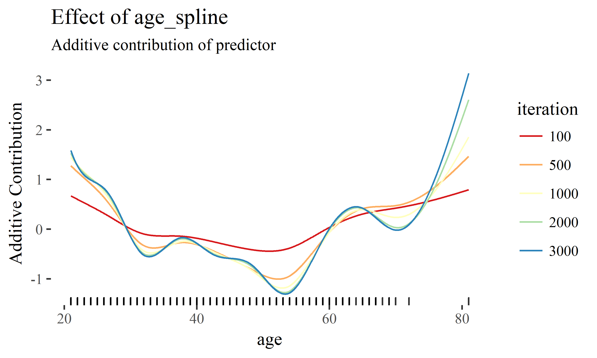

# Summary
<!-- A clear statement of need that illustrates the purpose of the software-->

Component-wise boosting applies the boosting framework  to statistical models, e.g., general additive models using component-wise smoothing splines [@schmid2008boosting]. Boosting these kinds of models maintains interpretability and enables unbiased model selection in high dimensional feature spaces.

The `R` [@R] package `compboost` is an implementation of component-wise boosting written in `C++` using `Armadillo` [@sanderson2016armadillo] to obtain high runtime performance and full memory control. The main idea is to provide a modular class system which can be extended without editing the source code. Therefore, it is possible to use R functions as well as C++ functions for custom base-learners, losses, logging mechanisms or stopping criteria. 

In addition to tree based boosting implementations as `xgboost` [@xgboost], `compboost`, which is not a tree based method, maintains interpretability by estimating parameter for each used base-learner. This allows visualizing the selected effects, jumping back and forth in the algorithm, and looking into the model how the learner are selected to obtain information about the feature importance. 

<!-- A summary describing the high-level functionality and purpose of the software for a diverse, non-specialist audience-->
# How to Use

The package provides two high level wrapper functions `boostLinear()` and `boostSplines()` to boost linear models or general additive models using p-splines of each numerical feature:
```r
library(compboost)

# Load data set with binary classification task:
data(PimaIndiansDiabetes, package = "mlbench")

# Quadratic loss as ordinary regression loss:
cboost = boostSplines(data = PimaIndiansDiabetes, target = "diabetes", 
	loss = BinomialLoss$new())
```

The resulting model is an object using `R6`. Hence, `mod` has member functions to access the elements of the model such as the names of registered base-learner, selected base-learner, the estimated parameter or continue the training:
```r
cboost$getBaselearnerNames()
## [1] "pregnant_spline" "glucose_spline"  "pressure_spline" "triceps_spline" 
## [5] "insulin_spline"  "mass_spline"     "pedigree_spline" "age_spline" 


selected.features = mod$selected()
table(selected.features)
## selected.features
##    age_spline glucose_spline    mass_spline 
##            23             61             16 

params = cboost$coef()
str(params)
## List of 4
##  $ age_spline    : num [1:24, 1] 0.40127 0.25655 0.14807 0.11766 -0.00586 ...
##  $ glucose_spline: num [1:24, 1] -0.2041 0.0343 0.2703 0.4921 0.6856 ...
##  $ mass_spline   : num [1:24, 1] 0.0681 0.0949 0.1216 0.1473 0.1714 ...
##  $ offset        : num 0.312

cboost$train(3000)
## 
## You have already trained 100 iterations.
## Train 2900 additional iterations.
## 
```

Additionally it is possible to visualize the effect of single features by calling the member function `plot()` of a specific learner. Additionally, it is possible to pass a vector of iterations used for the graphic:
```r
cboost$plot("age_spline", iters = c(100, 500, 1000, 2000, 3000))
```


Instead of using `boostLinear()` or `boostSplines()` one can also explicitely define the parts of the algorithm by using the `R6` interface:
```r
cboost = Compboost$new(data = PimaIndiansDiabetes, target = "diabetes",
loss = BinomialLoss$new())

# Adding a linear and spline base-learner to the Compboost object:
cboost$addBaselearner(feature = "mass", id = "linear", PolynomialBlearner,
degree = 1, intercept = TRUE)
cboost$addBaselearner(feature = "age", id = "spline", PSplineBlearner,
degree = 3, n.knots = 10, penalty = 2, differences = 2)

cboost$train(2000, trace = FALSE)
cboost
## Component-Wise Gradient Boosting
##
## Trained on PimaIndiansDiabetes with target diabetes
## Number of base-learners: 2
## Learning rate: 0.05
## Iterations: 2000
## Positive class: neg
## Offset: 0.3118
##
## BinomialLoss Loss:
##
##   Loss function: L(y,x) = log(1 + exp(-2yf(x))
##
##
```

A similar software is the well known `R` implementation `mboost` [@mboost1]. The advantage of `mboost` over `compboost` is the extensive functionality which includes more base-learners and loss functions (families). Nevertheless, `mboost` has issues when it comes to large datasets. In addition, `compboost` is much faster in terms of runtime and uses much less memory. This makes `compboost` more applicable in terms of big data. 

<!-- Mentions (if applicable) of any ongoing research projects using the software or recent scholarly publications enabled by it -->

The modular principle of `compboost` allows it to extend the algorithm to do more complicated analyses as boosting functional data, investigating on different optizer, or improve the intrinsic feature selection using resampling.

<!-- A list of key references including a link to the software archive -->
# References